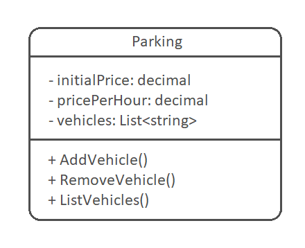

# Parking with C Sharp

Project developed at Digital Innovation One's Pottencial .NET Developer Bootcamp with guidance from expert [Leonardo Buta](https://github.com/leonardo-buta/ "Leonardo Buta").

Learning to build a system for a parking lot, which will be used to manage parked vehicles and carry out their operations, such as adding a vehicle, removing a vehicle (and displaying the amount charged during the period) and listing the vehicles.

[LICENSE](./LICENSE)
